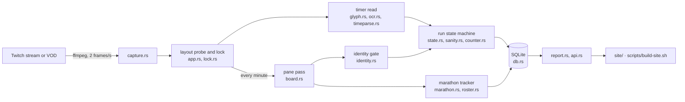

# How it works

A map for a first reading. The other documents go deep on one part each;
this one says how the parts fit and what the words mean.

## The pipeline

1. **Capture.** ffmpeg decodes the stream (or a VOD, for a replay) and
   hands the loop one frame every half second, cropped to the union of
   every layout's rectangles.
2. **Layout lock.** A *layout* is a set of rectangles on the 1080p canvas:
   where the timer is, where the splits column is, where the attempt
   counter is. The bot keeps several (the streamer has several scenes and
   themes) and *probes* them until one reads the timer on a run of frames;
   that layout holds the *lock* until its timer goes dark or reads poorly.
   A board (below) can grant the lock too.
3. **Timer read.** The timer crop is read by a template reader trained on
   the streamer's own footage (`glyph.rs`), with tesseract for the frames it
   declines; the text becomes milliseconds (`timeparse.rs`) and a smoothed
   clock decides whether a reading is plausible (`sanity.rs`).
4. **Runs.** The state machine turns the clock into attempts: a run starts
   when the timer runs from zero, resets when it goes back, finishes when
   it freezes on a value a split row shows. Each attempt is a row in
   `runs`, numbered by the streamer's own LiveSplit attempt counter when it
   can be read (`counter.rs`), with per-act splits when the column can be
   read (`splits.rs`).
5. **The pane pass.** About once a minute the whole LiveSplit pane is read
   as text: the header (game and category), the counter, and every row with
   its time cells (`board.rs`). Two things use it.
   - The **identity gate** (`identity.rs`) weighs header, category, counter
     and rows against the tracked game. A pane timing another game is not
     recorded as this one: its runs are filed under that game when a
     roster names it, and dropped when nothing does.
   - The **marathon tracker** (`marathon.rs`) takes over when the pane is a
     *board* — many games as rows, one time each — and records a run per
     row that completes, by the board's own arithmetic rather than the
     timer. `roster.rs` says which game each row's damaged name is.
6. **Report and site.** `report --json` projects the database into one
   document; `scripts/build-site.sh` bakes it into the pages and the JSON
   feed under `site/api/v1/`.

## Three kinds of record

| kind | where it comes from | `runs.category` | example |
|---|---|---|---|
| a run of the tracked game | the timer, step 4 | the configured category | Ninja Gaiden Any% |
| a practice run of another game | the timer, filed under the game the pane names | the roster's category for that game | a Big 20 game practised on its own splits |
| a marathon completion | a board row completing, step 5 | the event's category | one game of an Arcathlon, or of a full run of the Big 20 |

The site shows them apart: the tracked game's records, a page per event,
and the Big 20 pages.

## Offline tools

Everything the live bot does can be re-run on recorded footage, which is
how every rule in this repository was found and tested.

- `scripts/replay-window.sh` replays a window of a VOD and prints capture
  metrics; `scripts/obs-diff.sh` and `obs-accuracy.sh` compare and score
  the per-frame observation log.
- `scripts/replay-arcathlon.sh`, `replay-big20.sh` and the import scripts
  replay a whole board day from second 0 and land it in the live database.
- `ngtwitchtimer audit --dir` drives the marathon tracker over a recorded
  board log in a second; `NG_MARATHON_TRACE=<row>` prints every guard's
  answer for a row.
- `ngtwitchtimer pane` shows what a pane pass reads off one frame, per
  layout and threshold; `locate` finds the pane in a frame and draws every
  layout's crops.
- `scripts/audit-arcathlon.sh` scores the tracker against 38 recorded
  marathon days; a change to the tracker must leave it byte-identical.

## Glossary

- **layout** — a named set of crop rectangles for one on-screen arrangement
  of LiveSplit (`[[layouts]]` in the config); **crop** — one rectangle;
  **offset** — how far the layout has drifted from its configured place.
- **lock** — which layout the loop currently believes, and why (timer or
  board); **probe** — the search for a layout when there is none.
- **pane** — the LiveSplit window as a whole; **board** — a pane read as a
  table of rows; **row** — one split or one game; **cell** — one time in a
  row; **header** — the game and category lines above the rows.
- **segment** — a row's own time; **cumulative** — the clock when the row
  ended; **comparison** — the time a row shows before it is run (the
  previous run's, or the PB's); **baseline** — what a row showed when the
  tracker first looked, which a completion has to differ from.
- **roster** — a file naming an event's games (`assets/*.toml`);
  **event** — one marathon or race in it; **slot** — the tracker's place
  for one row of a board; **ordered** — an event whose games are run in
  the listed order, so slots follow the list.
- **session** — one capture of one broadcast; **VOD** — Twitch's archive
  of it; **replay** — running the bot over a VOD as if live; **backfill** —
  replaying old VODs to fill the database.
- **identity gate** — the decision whether the pane is timing the tracked
  game; **foreign run** — a run of another game filed under that game;
  **orphaned run** — one on a board nothing names, dropped at close.

## Reading order

1. `src/main.rs` — the subcommands and what each calls.
2. `src/app.rs` — the frame loop, top to bottom: capture, probe and lock,
   timer read, events, the pane pass, the database. It is long; the
   section comments are the table of contents.
3. `src/state.rs` and `src/sanity.rs` — how a clock becomes runs.
4. `src/board.rs` then `src/identity.rs` — how a pane becomes a board, and
   whose board it is.
5. `src/marathon.rs` and `src/roster.rs` — boards tracked by completions.
6. `docs/detection.md` for the reasoning behind each step, and
   `docs/operations.md` before touching the deployment.
